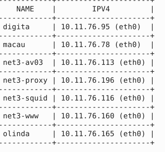
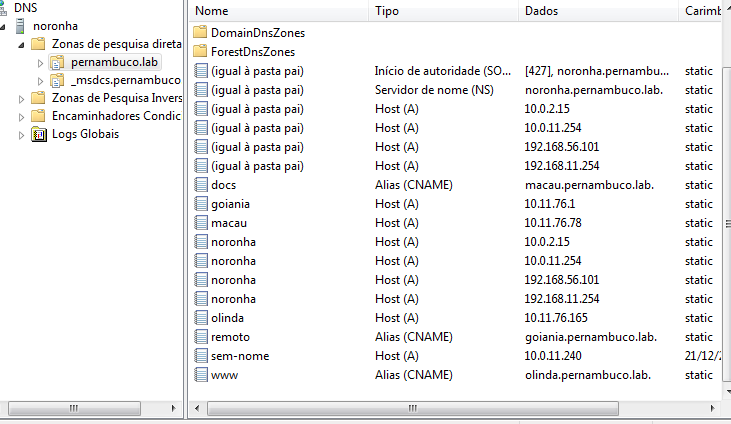

# DNS

## Instalação

Na instalação do DNS foi craido Dois Container um macau e outro olinda .

e tambem e modificado o arquivo `/etc/resolv.conf.`

`nano /etc/resolv.conf`

Os container usados na instalaçao do DNS :

[]

falta colocar os  prints do arquivo modificado para o DNS.

## Configuração

Incluir o(s) nome(s) e o conteúdo do(s) arquivo(s) de configuração.

Cinco registros (4 pontos cada):

- 3 do tipo A (Endereços);

Criação de 3 registros de recurso do tipo A => Hosts:

`nome dos 3 registros: macau, olinda, goiania :`

[]

- 2 do tipo CNAME (`www` e `docs`);

Criação de 2 registros do Tipo CNAME :

`Nome dos 2 registros : docs,www .`

[]

## Teste

depois da configuração 

E tanbém o print da pagina Web onde a url seria goiania.pernambuco.lab no navegador Firefox é registro CNAME:

Não coloquei o print pois a configuração do arquivo /etc/resolv.conf não lembro 

